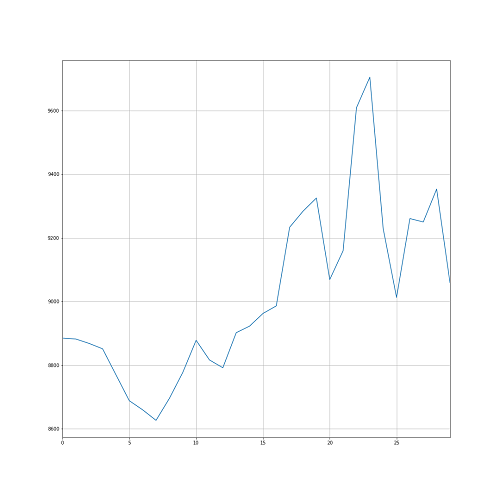
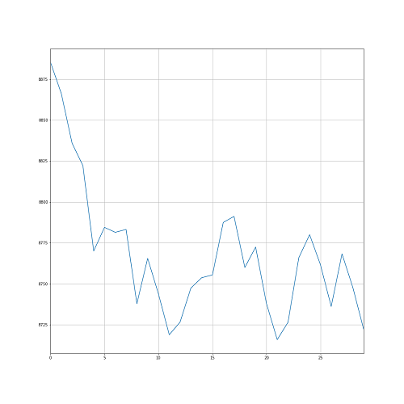
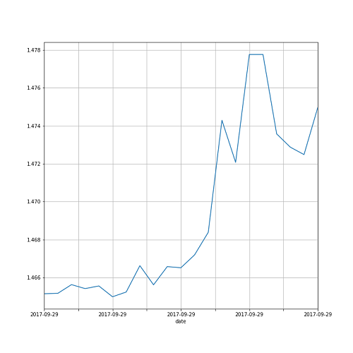
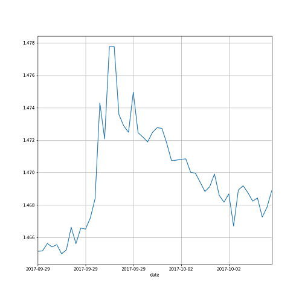

# Head-and-shoulders-pattern-detection
Using convolutional neural network to detect head and shoulders pattern

## Part 1 : Head-and-shoulders-pattern simulation
### Example of images generated from simulation considered as positive.

### Example of images generated from simulation considered as negative.

## Part 2 : Test on real data

### Example of Head and shoulders pattern detection

### Validation of the pattern detection

